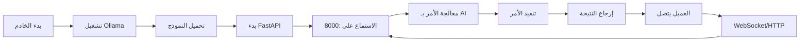

# Siamese
# 🤖 AI Control System - نظام التحكم الذكي عن بُعد

<div align="center">


**نظام متكامل للتحكم عن بُعد بالأجهزة باستخدام الذكاء الاصطناعي**

[المميزات](#-المميزات) • [التثبيت](#-التثبيت) • [الاستخدام](#-الاستخدام) • [الأوامر](#-الأوامر) • [حل المشاكل](#-حل-المشاكل)

</div>

---

## 📌 نظرة عامة

نظام AI Control System هو حل متكامل للتحكم عن بُعد بأجهزة Windows باستخدام الذكاء الاصطناعي. يتكون من خادم (Server) يعمل على جهاز مخصص، وعميل (Client) يمكن تشغيله من أي جهاز آخر على نفس الشبكة.

### 🎯 الهدف من المشروع

- **التحكم الكامل عن بُعد** بأجهزة Windows
- **معالجة الأوامر بالذكاء الاصطناعي** باستخدام Ollama و Open Interpreter
- **تنفيذ المهام التلقائية** بدون تدخل بشري
- **واجهة سهلة الاستخدام** عبر المتصفح أو سطر الأوامر

---

## 🏗️ البنية التقنية

### معمارية النظام

```
┌─────────────────────────┐         ┌─────────────────────────┐
│   الجهاز الخادم (Server) │◄────────►│   الجهاز العميل (Client)│
│                         │   LAN    │                         │
│ • Windows 10/11         │         │ • أي نظام تشغيل         │
│ • Intel i5-14400       │         │ • Python 3.8+           │
│ • RTX 2060 (6GB)       │         │ • متصفح ويب             │
│ • 24GB RAM             │         │                         │
│                         │         │                         │
│ المكونات:               │         │ المكونات:               │
│ - Ollama Server        │         │ - Client Script         │
│ - AI Models            │         │ - WebSocket Client      │
│ - FastAPI Server       │         │ - Control Interface     │
│ - Open Interpreter     │         │                         │
└─────────────────────────┘         └─────────────────────────┘
```

### التقنيات المستخدمة

| التقنية | الإصدار | الوظيفة |
|---------|---------|---------|
| Python | 3.11+ | لغة البرمجة الأساسية |
| FastAPI | 0.104.1 | إطار عمل الخادم |
| Uvicorn | 0.24.0 | خادم ASGI |
| Ollama | Latest | تشغيل نماذج AI محلياً |
| Open Interpreter | Latest | معالج الأوامر الذكي |
| WebSockets | 12.0 | الاتصال في الوقت الفعلي |
| PyAutoGUI | 0.9.54 | التحكم بالماوس والكيبورد |

---

## 📦 محتويات المشروع

```
AI_Control_System/
│
├── 📁 Server (الخادم)/
│   ├── 📄 SERVER_CONTROL.bat     # واجهة التحكم بالخادم
│   ├── 🐍 ai_server.py          # الخادم الرئيسي
│   ├── 📁 ai_env/               # البيئة الافتراضية
│   ├── 📁 logs/                 # سجلات النظام
│   │   ├── install.log
│   │   └── server.log
│   ├── 📁 AI_Memory/            # نظام الذاكرة
│   │   ├── config/
│   │   ├── memory/
│   │   ├── templates/
│   │   └── documents/
│   └── 📄 server_ip.txt         # IP الخادم المحفوظ
│
├── 📁 Client (العميل)/
│   ├── 📄 CLIENT_CONTROL.bat    # واجهة التحكم بالعميل
│   ├── 🐍 ai_client.py         # سكريبت العميل
│   └── 📄 server_config.txt    # إعدادات الاتصال
│
└── 📄 README.md                 # هذا الملف
```

---

## 🚀 التثبيت

### متطلبات النظام

#### للخادم (Server):
- **نظام التشغيل:** Windows 10/11 (64-bit)
- **المعالج:** Intel Core i5 أو أفضل
- **الذاكرة:** 16GB RAM (24GB موصى به)
- **كرت الشاشة:** NVIDIA RTX 2060 أو أفضل (6GB VRAM)
- **التخزين:** 50GB مساحة فارغة
- **الشبكة:** اتصال LAN ثابت

#### للعميل (Client):
- **نظام التشغيل:** Windows/Mac/Linux
- **Python:** 3.8 أو أحدث
- **الشبكة:** نفس شبكة الخادم

### 📥 خطوات التثبيت

#### 1️⃣ تثبيت الخادم (Server)

```batch
# 1. انسخ ملفات المشروع إلى المجلد المطلوب
C:\Users\cmver\OneDrive\سطح المكتب\M\

# 2. شغّل كـ Administrator
SERVER_CONTROL.bat

# 3. اختر من القائمة
[1] INSTALL - للتثبيت الكامل (أول مرة)

# 4. انتظر حتى اكتمال التثبيت (15-20 دقيقة)
# سيتم تثبيت:
# - Python 3.11
# - Git
# - Ollama
# - المكتبات المطلوبة
# - النماذج الذكية

# 5. احفظ IP الخادم الذي يظهر
# مثال: 192.168.100.102
```

#### 2️⃣ تثبيت العميل (Client)

```batch
# 1. على جهازك الشخصي، شغّل
CLIENT_CONTROL.bat

# 2. اختر من القائمة
[1] SETUP - للإعداد

# 3. أدخل IP الخادم
Enter Server IP: 192.168.100.102

# 4. انتظر تثبيت المكتبات
```

---

## 💻 الاستخدام

### 🎮 واجهة التحكم بالخادم (SERVER_CONTROL.bat)

```
================================================================================
                          AI SERVER CONTROL CENTER
================================================================================

[1] INSTALL - Complete Server Setup (First Time)
[2] START   - Start AI Server
[3] STOP    - Stop AI Server  
[4] STATUS  - Check Server Status
[5] UPDATE  - Update Models
[6] MEMORY  - Setup AI Memory System
[7] FIX     - Fix Common Issues
[8] INFO    - Show Server Information
[0] EXIT    - Close Control Center
```

#### شرح الخيارات:

| الخيار | الوظيفة | متى تستخدمه |
|--------|---------|-------------|
| **[1] INSTALL** | تثبيت كامل للنظام | أول مرة فقط |
| **[2] START** | تشغيل الخادم | كل مرة تريد البدء |
| **[3] STOP** | إيقاف الخادم | عند الانتهاء |
| **[4] STATUS** | فحص حالة النظام | للتأكد من العمل |
| **[5] UPDATE** | تحديث/إضافة نماذج AI | لتحسين الأداء |
| **[6] MEMORY** | إعداد نظام الذاكرة | للمشاريع المتقدمة |
| **[7] FIX** | إصلاح المشاكل | عند حدوث أخطاء |
| **[8] INFO** | معلومات النظام | لمعرفة التفاصيل |

### 🎮 واجهة التحكم بالعميل (CLIENT_CONTROL.bat)

```
================================================================================
                          AI CLIENT CONTROL CENTER
================================================================================

[1] SETUP   - Install Client & Connect to Server
[2] CONNECT - Connect to AI Server
[3] TEST    - Test Server Connection
[4] CONTROL - Start Remote Control Session
[5] COMMAND - Send Single Command
[6] MONITOR - View Active Sessions
[7] UPDATE  - Update Client Software
[8] HELP    - Show Help & Commands
[0] EXIT    - Close Control Center
```

#### شرح الخيارات:

| الخيار | الوظيفة | الاستخدام |
|--------|---------|-----------|
| **[1] SETUP** | إعداد العميل | أول مرة فقط |
| **[2] CONNECT** | الاتصال بالخادم | للاتصال المباشر |
| **[3] TEST** | اختبار الاتصال | للتأكد من الشبكة |
| **[4] CONTROL** | جلسة تحكم تفاعلية | للتحكم الكامل |
| **[5] COMMAND** | إرسال أمر واحد | للأوامر السريعة |
| **[6] MONITOR** | مراقبة الجلسات | لمعرفة الحالة |
| **[7] UPDATE** | تحديث المكتبات | للصيانة |
| **[8] HELP** | المساعدة | لمعرفة الأوامر |

---

## 📡 نقاط الوصول (Endpoints)

### HTTP Endpoints

| المسار | النوع | الوظيفة | مثال |
|--------|-------|---------|------|
| `/` | GET | الصفحة الرئيسية | http://192.168.100.102:8000 |
| `/status` | GET | حالة الخادم | http://192.168.100.102:8000/status |
| `/process` | POST | معالجة أمر | `{"command": "open chrome"}` |
| `/history` | GET | سجل الأوامر | http://192.168.100.102:8000/history |
| `/health` | GET | فحص صحة النظام | http://192.168.100.102:8000/health |

### WebSocket Endpoint

```javascript
// الاتصال عبر WebSocket
ws://192.168.100.102:8000/ws

// رسائل WebSocket
{
    "type": "command",
    "command": "open notepad",
    "context": {}
}
```

---

## 🎯 الأوامر المتاحة

### أوامر أساسية

| الأمر | الوظيفة | مثال |
|-------|---------|------|
| `open chrome` | فتح متصفح Chrome | "Open Chrome" |
| `open notepad` | فتح المفكرة | "Open Notepad" |
| `open youtube` | فتح YouTube | "Go to YouTube" |
| `take screenshot` | أخذ لقطة شاشة | "Take a screenshot" |
| `open task manager` | فتح مدير المهام | "Open Task Manager" |
| `open file explorer` | فتح مستكشف الملفات | "Open File Explorer" |

### أوامر النظام

| الأمر | الوظيفة | احتياطات |
|-------|---------|----------|
| `shutdown` | إيقاف الجهاز | يتم بعد 60 ثانية |
| `restart` | إعادة تشغيل | يتم بعد 60 ثانية |
| `lock screen` | قفل الشاشة | فوري |
| `system info` | معلومات النظام | آمن |

### أوامر متقدمة

```python
# أمثلة على أوامر معقدة
"Create a folder called Projects on desktop"
"Open Chrome and search for Python tutorials"
"Take a screenshot and save it as report.png"
"List all files in the current directory"
"Check CPU and memory usage"
```

---

## 🛠️ نماذج AI المتاحة

### للأجهزة مع RTX 2060 (6GB VRAM)

| النموذج | الحجم | الاستخدام | الأداء |
|---------|-------|-----------|--------|
| **qwen2.5-coder:7b** | 4.7GB | البرمجة والأكواد | ⭐⭐⭐⭐⭐ |
| **llama3.2:3b** | 2.0GB | عام وسريع | ⭐⭐⭐⭐ |
| **mistral:7b** | 4.1GB | متوازن | ⭐⭐⭐⭐ |
| **deepseek-coder:6.7b** | 3.8GB | برمجة متقدمة | ⭐⭐⭐⭐⭐ |
| **phi3:mini** | 2.3GB | خفيف وسريع | ⭐⭐⭐ |

### تثبيت نموذج جديد

```batch
# من قائمة SERVER_CONTROL
[5] UPDATE - Update Models

# أو مباشرة
ollama pull model_name
```

---

## 🔧 حل المشاكل

### المشكلة 1: الخادم لا يعمل

```batch
# الحل
1. تأكد من تشغيل كـ Administrator
2. استخدم خيار [7] FIX
3. تأكد من وجود ai_server.py
4. راجع logs/server.log
```

### المشكلة 2: لا يمكن الاتصال من العميل

```batch
# الحل
1. تأكد أن الجهازين على نفس الشبكة
2. افحص Windows Firewall:
   netsh advfirewall firewall add rule name="AI Server" dir=in action=allow protocol=TCP localport=8000
3. جرب ping للخادم:
   ping 192.168.100.102
```

### المشكلة 3: Ollama لا يعمل

```batch
# الحل
1. أوقف العمليات:
   taskkill /F /IM ollama.exe
2. أعد التشغيل:
   set OLLAMA_HOST=0.0.0.0
   ollama serve
```

### المشكلة 4: Python غير موجود

```batch
# الحل
1. حمّل Python 3.11 من python.org
2. تأكد من إضافته لـ PATH
3. أعد تشغيل الجهاز
```

---

## 📊 مراقبة الأداء

### من المتصفح

```
http://192.168.100.102:8000/status
```

### من سطر الأوامر

```python
import requests
response = requests.get("http://192.168.100.102:8000/status")
print(response.json())
```

### السجلات

```
# سجل التثبيت
logs/install.log

# سجل الخادم
logs/server.log

# سجل الأوامر
عبر /history endpoint
```

---

## 🔐 الأمان

### إجراءات الأمان المطبقة

1. **CORS Configuration** - السماح للأصول المحددة فقط
2. **Firewall Rules** - قواعد جدار حماية Windows
3. **Local Network Only** - يعمل على الشبكة المحلية فقط
4. **Command Validation** - التحقق من الأوامر الخطرة
5. **Logging** - تسجيل كل العمليات

### توصيات إضافية

```batch
# 1. استخدم VPN للاتصال الآمن
# 2. غيّر المنفذ الافتراضي إذا لزم
# 3. أضف كلمة مرور للـ API
# 4. حدد IP addresses المسموحة
```

---

## 🚦 سير العمل النموذجي



---

## 📈 خطط التطوير المستقبلية

- [ ] إضافة واجهة ويب متقدمة
- [ ] دعم المصادقة والتشفير
- [ ] التحكم بأجهزة متعددة
- [ ] تسجيل الماكرو وإعادة التشغيل
- [ ] التكامل مع المساعدات الصوتية
- [ ] دعم Linux و macOS
- [ ] تطبيق موبايل للتحكم

---

## 🤝 المساهمة

نرحب بالمساهمات! يرجى:

1. Fork المشروع
2. إنشاء فرع للميزة (`git checkout -b feature/AmazingFeature`)
3. Commit التغييرات (`git commit -m 'Add some AmazingFeature'`)
4. Push للفرع (`git push origin feature/AmazingFeature`)
5. فتح Pull Request

---

## 📝 الترخيص

هذا المشروع مرخص تحت رخصة MIT - انظر ملف [LICENSE](LICENSE) للتفاصيل.

---

## 👨‍💻 المطور

**محمد عبدالله القحطاني**

- 📧 Email: moha.alnamlan@gmail.com
- 📱 WhatsApp: +966540601467
- 💼 LinkedIn: [mohammed-abdullah](https://www.linkedin.com/in/mohammed-abdullah-2a7175338/)

---

## 🙏 الشكر والتقدير

- **OpenAI** - لتقنيات الذكاء الاصطناعي
- **Anthropic** - للمساعدة في التطوير
- **Ollama Team** - لتوفير النماذج المحلية
- **FastAPI** - لإطار العمل الممتاز
- **مجتمع Python** - للمكتبات والأدوات

---

## 📞 الدعم الفني

### للمساعدة السريعة:

1. **راجع قسم** [حل المشاكل](#-حل-المشاكل)
2. **افحص السجلات** في مجلد `logs/`
3. **استخدم خيار** `[7] FIX` في SERVER_CONTROL
4. **تواصل عبر** WhatsApp أو Email

### معلومات مفيدة:

```python
# فحص سريع للنظام
import platform
import psutil

print(f"OS: {platform.system()} {platform.release()}")
print(f"Python: {platform.python_version()}")
print(f"CPU: {psutil.cpu_count()} cores")
print(f"RAM: {psutil.virtual_memory().total / (1024**3):.1f} GB")
print(f"Network: {[i.address for i in psutil.net_if_addrs()['Ethernet']]}")
```

---

<div align="center">

**🌟 شكراً لاستخدامك AI Control System 🌟**

صُنع بـ ❤️ في المملكة العربية السعودية

[⬆ العودة للأعلى](#-ai-control-system---نظام-التحكم-الذكي-عن-بعد)

</div>